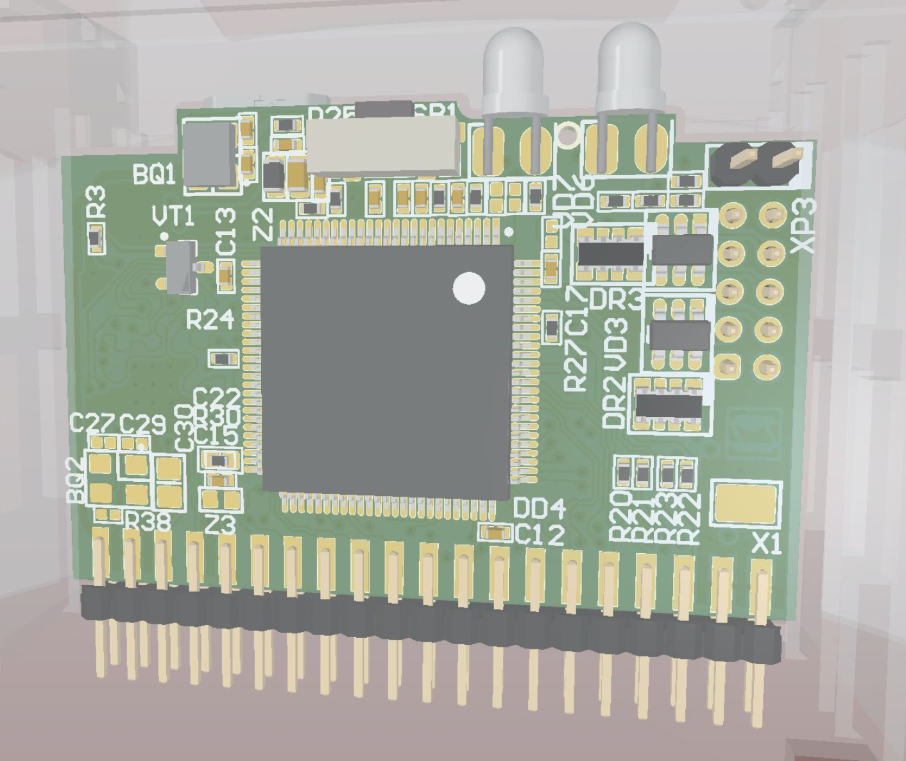

.. _stm32f103_mini_board:

STM32F103 Mini
################

Overview
********

SOVA427 плата основанная на AMR Cortex-M3 MCU - STM32F427VIT6

Hardware
********
SOVA427 состоит из следующих компонентов:

- STM32 microcontroller QFP100 package

- 2 LED:

  - User 2 color LED (VD7 - PD13), power LED (LD6 - PD14(YARC), PD13(YCRA))

- User Button (nBTN, SB1 - PC15)

- USB